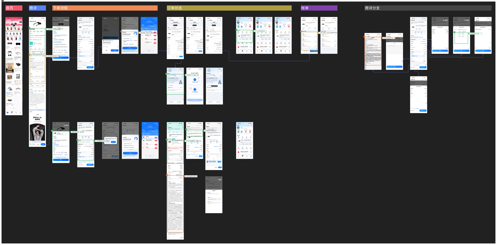

# zhima-rental 竞品流程分析报告

生成日期：2026-05-25

## 1. 输入与范围

- 输入文件：`inputs/芝麻租赁.pdf`
- 输出目录：`outputs/zhima-rental`
- 分析对象：已拼接的芝麻租赁移动端竞品流程图，覆盖首页、商品详情、下单流程、订单状态、账单和商详分支。
- 方法说明：先将 PDF 渲染为 `canvas.png`，再自动切分 33 个屏幕截图；随后基于可见 UI 文案、层级、状态与业务信息生成结构化分析点。本文只基于截图中可见信息，不推断未展示的后台规则。

## 2. 流程结构概览

这张流程图由六条泳道构成：

- 首页：从“芝麻租赁”频道入口和商品流进入租赁商品。
- 商详：商品详情展示日租价、租期价格、信用免押、租赁方案、租后方案、常见问题和商品详情。
- 下单流程：配置租期/方案、确认订单、芝麻信用授权、优惠券、支付/确认等节点。
- 订单状态：覆盖审核中、待发货、已发货、租用中、补充身份证、商家延迟发货、物流详情等状态。
- 账单：展示应付/已付/未付租金、分期账单、支付状态和费用明细。
- 商详分支：协议、备注、首期实付租金、租金付款计划、总租金优惠等解释性分支。

## 3. 执行结论

芝麻租赁这组流程的核心优势是把租赁业务里最容易制造不信任的部分持续外显：芝麻信用免押、首期租金、总租金、期数、商家审核、身份证补充、账单分期、履约/违约责任都能在关键节点被看见。主要问题不在功能缺失，而在信息密度和责任文案的组织方式：用户能找到规则，但需要在多个长页、弹窗和订单状态之间反复理解，决策成本偏高。

## 4. 标注总图

### 核心发现

- 商品详情页先用日租价、租期价格、信用免押和租后方案降低进入门槛，再在下单页显性拆分首期、剩余租金、总租金和免押金额。
- 流程把租赁履约状态拆成提交成功、订单审核、支付租金、订单发货、签收使用、归还/买断/续租、订单完成，状态颗粒度清晰。
- 审核失败/补充资料/商家延迟发货等风险状态有入口和行动按钮，但解释文本依赖长文和协议，快速理解成本较高。
- 账单和费用明细支持分期查看、已付/未付区分和优惠拆解，是值得借鉴的后置解释机制。

### 设计机会

- 把首期应付、免押金额、剩余分期、逾期/损坏责任做成可复用的“租赁决策摘要”，贯穿详情页、确认订单、审核中、租用中和账单。
- 将长协议拆成分层摘要：先给用户三到五条可执行责任，再提供完整协议入口，降低阅读阻力同时保留合规完整性。
- 订单状态页可把“为什么卡住、谁在处理、预计多久、用户还能做什么”做成统一状态解释模块，减少客服依赖。
- 账单页可在未选择分期时降低“去支付”按钮优先级，或增加默认选中/明确空状态，减少支付前的选择歧义。

## 5. 关键发现列表

| ID | 严重度 | 分类 | 页面 | 问题 / 亮点 | 建议 |
|---|---|---|---|---|---|
| A1 | positive | positive_reference | 商品详情页 | 决策信息前置，先回答租赁是否划算 | 自有方案可复用这种前置结构，但把“首期应付、后续分期、押金风险”压缩成一块更稳定的摘要，避免用户只记住低日租价。 |
| A2 | medium | decision_cost | 商品详情页 | 规则完整但阅读成本集中在长页中段 | 在 CTA 上方增加一条可展开的风险摘要，例如“免押不等于免赔，损坏/逾期将扣除相应费用”，让关键责任跟随行动出现。 |
| A3 | positive | conversion_pattern | 商详租赁配置弹窗 | 配置决策被收敛到一个确认面板 | 保留底部面板的高效形态，同时在日期与租期附近显示首期变化，避免用户配置后才在确认订单页发现价格变化。 |
| A4 | positive | business_rule_exposure | 确认订单页 | 下单前清楚拆出首期、剩余租金和免押 | 自有设计应把这类费用拆分视为核心组件，而不是普通订单金额行；它直接影响用户对免押租赁的信任。 |
| A5 | medium | trust_and_risk | 芝麻信用授权弹窗 | 免押价值清楚，但授权协议说明弱于主按钮 | 把“授权会用于什么、不会用于什么、发生损坏如何处理”做成按钮上方的三点摘要，协议链接作为完整说明承接。 |
| A6 | positive | state_feedback | 订单审核页 | 审核中解释了为什么需要个人信息 | 值得学习这种“状态 + 原因 + 下一步”的结构；自有流程可以进一步增加预计审核时长和逾期未处理后果。 |
| A7 | positive | trust_and_risk | 租用中订单详情页 | 租用中状态持续暴露风险、担保和交易证据 | 租赁产品不应只在下单前解释规则；履约中也要持续把责任、证据和救济入口放在用户可见位置。 |
| A8 | high | copywriting | 租用中订单详情页 | 违约责任完整但难以快速形成行动判断 | 把长文前置成责任摘要表：触发条件、用户要做什么、费用/后果、处理入口；完整协议放在次级入口。 |
| A9 | positive | flow_logic | 待发货状态页 | 状态颗粒度贴合租赁履约链路 | 自有流程应把状态模型按租赁履约设计，而不是复用普通订单状态；状态名称本身就是用户教育。 |
| A10 | positive | cta_strategy | 我的页面订单卡 | 个人中心给出状态相关动作 | 个人中心应承担租赁履约入口，不只是资产列表；按状态露出最可能的下一步动作能减少用户返回订单详情的次数。 |
| A11 | medium | decision_cost | 账单详情页 | 账单可分期选择，但未选中时支付意图不够明确 | 未选择账单时可禁用主按钮或默认选中最早到期一期，并把“可提前支付租金”转化为明确选择提示。 |
| A12 | high | trust_and_risk | 租赁服务协议页 | 协议页承载完整合规内容，但缺少阅读导航 | 在协议页顶部加入“你需要重点知道的 5 件事”和章节锚点；完整条款保留，但先服务用户理解。 |
| A13 | positive | business_rule_exposure | 租金付款计划弹窗 | 费用拆解支持向下钻取 | 保留这种向下钻取，但入口文案要直接说明它解释的是付款计划，而不是泛化的金额详情。 |

## 6. 分屏分析

### 商品详情页 `screen_002`

#### A1 决策信息前置，先回答租赁是否划算

- 分类：positive_reference
- 严重度：positive
- 目标区域：价格、信用免押与租赁方案区
- 洞察：页面顶部同时展示日租价、不同租期价格、信用免押、租赁方式、租期和租后方案，用户不用先进入下单页就能判断基本成本和履约方式。
- 证据：可见信息包括“信用免押”、租 3 天/7 天/30 天/90 天价格、到期可归还/续租、续/买/归还方案等。
- 建议：自有方案可复用这种前置结构，但把“首期应付、后续分期、押金风险”压缩成一块更稳定的摘要，避免用户只记住低日租价。

#### A2 规则完整但阅读成本集中在长页中段

- 分类：decision_cost
- 严重度：medium
- 目标区域：租赁说明、规则与底部 CTA
- 洞察：租赁规则、损坏赔偿、租期计算、取消退款等内容都能找到，但它们被放在长滚动页面中，与固定底部 CTA 的即时行动距离较远。
- 证据：页面中段有“商家损坏赔付说明”“租期计算规则”等长文，底部仍固定“去免押租”主按钮。
- 建议：在 CTA 上方增加一条可展开的风险摘要，例如“免押不等于免赔，损坏/逾期将扣除相应费用”，让关键责任跟随行动出现。

### 商详租赁配置弹窗 `screen_004`

#### A3 配置决策被收敛到一个确认面板

- 分类：conversion_pattern
- 严重度：positive
- 目标区域：底部配置弹窗
- 洞察：用户从商品详情进入租赁配置后，收货方式、租赁方案、颜色、租期和起止日期被集中在同一个底部面板，减少了跨页跳转。
- 证据：弹窗内可见快递配送、到期可归还/续租、黑色、3/7/30/90 天/自选租期、租期起止日期和确认按钮。
- 建议：保留底部面板的高效形态，同时在日期与租期附近显示首期变化，避免用户配置后才在确认订单页发现价格变化。

### 确认订单页 `screen_006`

#### A4 下单前清楚拆出首期、剩余租金和免押

- 分类：business_rule_exposure
- 严重度：positive
- 目标区域：费用明细与免押金额
- 洞察：确认订单页把首期实付、剩余租金、总租金、运费、实付押金和芝麻信用免押金额放在同一屏，能帮助用户确认现金流与信用担保关系。
- 证据：可见首期实付租金 ¥174.17、剩余租金、总租金 ¥522.50、实付押金 ¥0.00、芝麻信用免押以及已减免金额。
- 建议：自有设计应把这类费用拆分视为核心组件，而不是普通订单金额行；它直接影响用户对免押租赁的信任。

### 芝麻信用授权弹窗 `screen_007`

#### A5 免押价值清楚，但授权协议说明弱于主按钮

- 分类：trust_and_risk
- 严重度：medium
- 目标区域：芝麻信用授权说明
- 洞察：弹窗把芝麻分、已免押金额、首期金额和损坏扣押金说清楚，信任建立很强；但协议与服务条款位于主按钮下方，视觉优先级明显弱于确认动作。
- 证据：弹窗展示“你的芝麻分已达标”“本单押金已免除”“物品若丢失或损坏，将扣除相应押金”，底部小字列出多份协议。
- 建议：把“授权会用于什么、不会用于什么、发生损坏如何处理”做成按钮上方的三点摘要，协议链接作为完整说明承接。

### 订单审核页 `screen_012`

#### A6 审核中解释了为什么需要个人信息

- 分类：state_feedback
- 严重度：positive
- 目标区域：审核原因与资料补充卡片
- 洞察：审核状态没有只给一个等待进度条，而是解释商家为什么要判断履约能力，并给出身份证照片补充入口。
- 证据：页面写明“为什么审核需要我提供个人信息？”并展示“上传个人信息 / 身份证照片 / 去上传”。
- 建议：值得学习这种“状态 + 原因 + 下一步”的结构；自有流程可以进一步增加预计审核时长和逾期未处理后果。

### 租用中订单详情页 `screen_013`

#### A7 租用中状态持续暴露风险、担保和交易证据

- 分类：trust_and_risk
- 严重度：positive
- 目标区域：订单中风险与担保信息
- 洞察：订单进入履约后仍持续展示举报、首期应付、配送、平台担保、冻结押金、交易快照和协议入口，降低了租赁中后段的不确定性。
- 证据：可见“举报”“平台担保 诚租敢赔”“冻结押金”“交易快照”“租用服务相关协议”等模块。
- 建议：租赁产品不应只在下单前解释规则；履约中也要持续把责任、证据和救济入口放在用户可见位置。

#### A8 违约责任完整但难以快速形成行动判断

- 分类：copywriting
- 严重度：high
- 目标区域：违约责任长文
- 洞察：页面把逾期、提前归还、买断、续租、赔偿等责任用大段协议式文本呈现，信息完整但不适合移动端快速理解。
- 证据：“关于违约”区域包含多段长文，涵盖逾期交租/归还、提前归还/退租、买断、续租、赔偿等责任。
- 建议：把长文前置成责任摘要表：触发条件、用户要做什么、费用/后果、处理入口；完整协议放在次级入口。

### 待发货状态页 `screen_015`

#### A9 状态颗粒度贴合租赁履约链路

- 分类：flow_logic
- 严重度：positive
- 目标区域：订单状态进度条
- 洞察：流程不是普通电商的下单-发货-收货，而是拆成免押下单、商家发货、签收使用、购买/归还/续租、订单完成，能反映租赁业务真实任务。
- 证据：待发货页面顶部进度条显示“免押下单、商家发货、签收使用、购买/归还/续租、订单完成”。
- 建议：自有流程应把状态模型按租赁履约设计，而不是复用普通订单状态；状态名称本身就是用户教育。

### 我的页面订单卡 `screen_021`

#### A10 个人中心给出状态相关动作

- 分类：cta_strategy
- 严重度：positive
- 目标区域：我的订单卡片
- 洞察：我的页面没有只展示订单列表，而是把待处理订单与审核投诉、联系商家、去支付等动作放在同一卡片内，适合高频回访。
- 证据：订单卡片内可见“待发货”“审核投诉”“联系商家”“去支付”等操作。
- 建议：个人中心应承担租赁履约入口，不只是资产列表；按状态露出最可能的下一步动作能减少用户返回订单详情的次数。

### 账单详情页 `screen_025`

#### A11 账单可分期选择，但未选中时支付意图不够明确

- 分类：decision_cost
- 严重度：medium
- 目标区域：分期账单选择与支付栏
- 洞察：账单页清楚列出每期租金、优惠和计划付款时间；但默认未勾选时底部总计为 ¥0.00，同时仍有强主按钮“去支付”，会让用户需要额外判断是否必须先选期数。
- 证据：1/3、2/3、3/3 期均有单选圆点和待支付状态，底部显示“总计：¥0.00 / 去支付”。
- 建议：未选择账单时可禁用主按钮或默认选中最早到期一期，并把“可提前支付租金”转化为明确选择提示。

### 租赁服务协议页 `screen_027`

#### A12 协议页承载完整合规内容，但缺少阅读导航

- 分类：trust_and_risk
- 严重度：high
- 目标区域：完整协议阅读页
- 洞察：完整协议页面对商家、平台、订单、收货、违约等条款有全面描述，但移动端长文没有目录、摘要或重点标记，用户很难在下单前抓住关键风险。
- 证据：协议页为连续长文，顶部仅有标题“协议”，正文密集展示租赁服务协议条款。
- 建议：在协议页顶部加入“你需要重点知道的 5 件事”和章节锚点；完整条款保留，但先服务用户理解。

### 租金付款计划弹窗 `screen_032`

#### A13 费用拆解支持向下钻取

- 分类：business_rule_exposure
- 严重度：positive
- 目标区域：付款计划明细弹窗
- 洞察：在账单/确认订单分支中，用户可以查看每期扣款计划、优惠前金额和具体日期，补足了下单页无法承载的明细。
- 证据：弹窗显示“租金总额 ¥486.00（优惠前 ¥540.00）”、第 1/2/3 期、日期和每期 ¥162.00。
- 建议：保留这种向下钻取，但入口文案要直接说明它解释的是付款计划，而不是泛化的金额详情。

## 7. 值得学习的模式

- 决策摘要前置：在商品详情和确认订单里持续展示租期、租金、免押和租后方案，降低用户进入下单的心理门槛。
- 租赁状态专门化：状态链路围绕“审核、发货、签收使用、归还/买断/续租”设计，而不是简单复用电商订单状态。
- 信用背书可视化：芝麻信用分、免押金额和服务商保障形成信任闭环，适合高客单、需履约的租赁业务。
- 后置解释入口：账单、付款计划、优惠合计、协议和交易快照可以被下钻查看，减少主流程一次性承载过多细节。

## 8. 需要避免的风险

- 不要只用低日租价吸引点击。租赁用户最终决策看的是首期现金流、总租金、押金风险和违约责任。
- 不要把关键责任全部交给协议长文。移动端长文可作为完整依据，但不能替代可执行摘要。
- 不要把审核状态做成单纯等待。用户需要知道为什么卡住、谁处理、多久处理、自己能做什么。
- 不要让账单支付按钮在无选择状态下保持强可点感。支付类动作需要清楚表达当前金额和选择来源。

## 9. 行动建议

1. 建立一套贯穿全流程的租赁费用摘要组件：首期应付、剩余分期、总租金、免押金额、可能扣费责任。
2. 为每个订单状态定义统一解释模型：当前状态、原因、预计时间、用户下一步、商家/平台下一步、客服入口。
3. 将协议和违约责任拆成“双层阅读”：上层是责任摘要表，下层是完整协议原文。
4. 在账单页优化选择逻辑：默认选中最早应付账单，或未选中时禁用支付按钮并明确提示。
5. 把个人中心作为履约工作台，而不仅是订单入口；按状态显示审核、联系商家、支付、查看物流、归还等动作。

## 10. 附录：检测置信度与未解决歧义

- 自动切屏结果是否完整。
- OCR / VLM 读取到的文案是否准确。
- 标注框是否准确落在对应 UI 元素上。
- 业务判断是否只基于可见界面信息和用户提供上下文。
- 本次自动检测到 33 个屏幕，视觉检查未发现明显错切；但 PDF 原图文字较小，部分超小字号文案仍建议人工复核。
- 本报告没有判断实际合规性，只分析界面中可见的提示、解释和用户理解成本。
